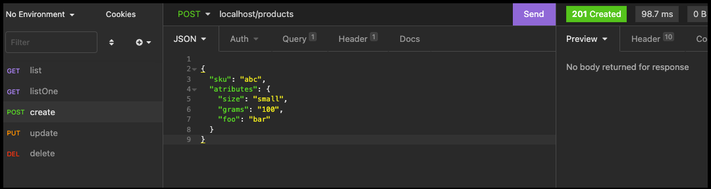

<div align="center">



# Title


## Run project

```
docker-compose up -d
composer install
```

## Stop project

```
docker-compose down
```

## :memo: License

The [MIT License]() (MIT)

## :smiley_cat: Author

- [@walternascimentobarroso](https://walternascimentobarroso.github.io/)

Made with &nbsp;❤️&nbsp;
